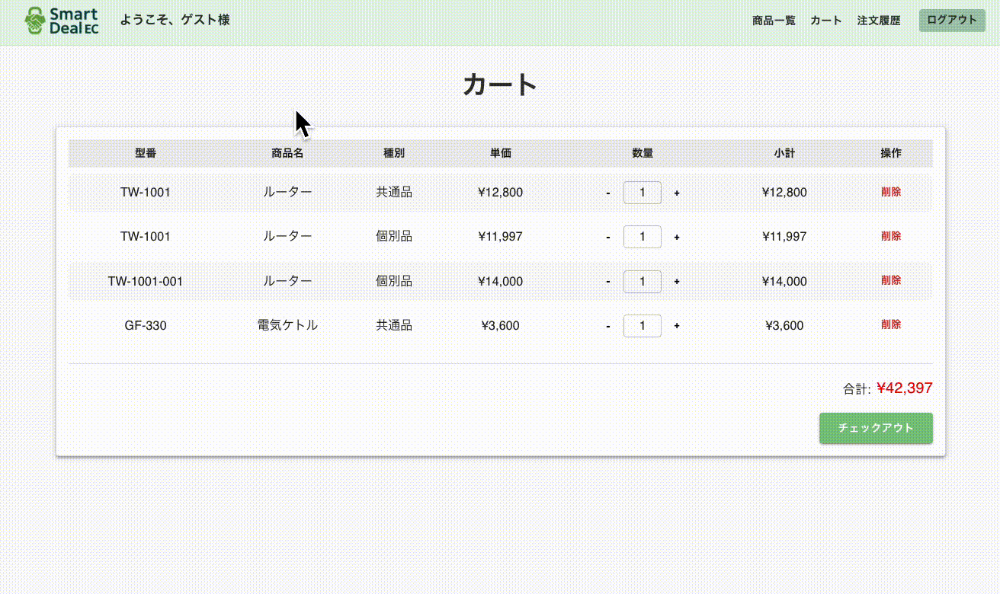
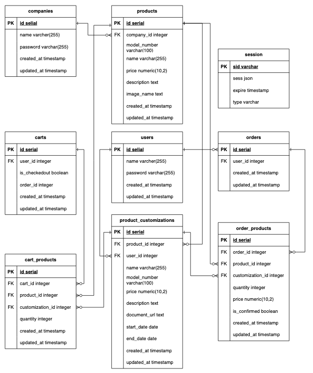
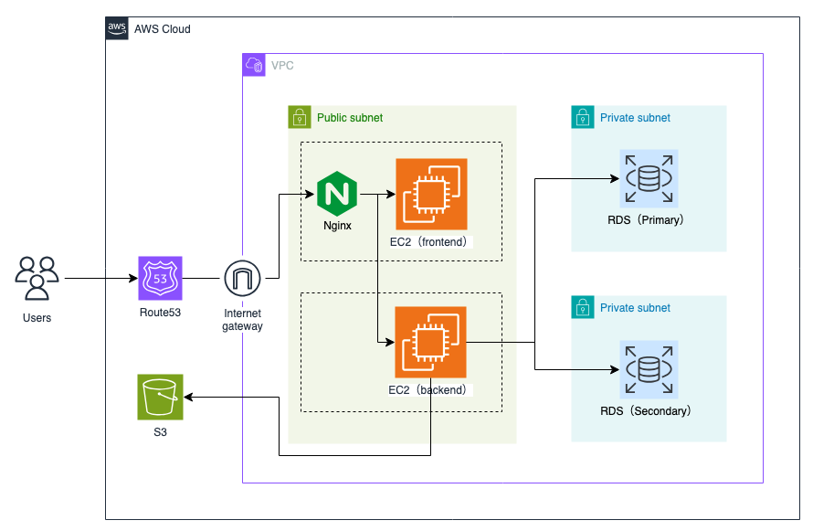

# Smart Deal EC


## 📌 サービス概要

- **サービス名**：Smart Deal EC
- **URL**：https://smartdealec.com/
- **概要**：
  製造業・小売業向けの BtoB 対応 EC システムです。
  特に、既存事業の非効率性を解消し、お客様の事業成長を促進するよう、以下の価値提供を提供します。

  - **アナログ業務の解消**；
    電話・FAX・メールといったアナログな受注処理を**デジタル化**し、業務の**大幅な省力化を促進**します。
  - **ビジネスの発展支援**：新たな販路開拓や売上機会の最大化を支援し、お客様のビジネスの**さらなる発展に貢献**します。
  - **柔軟な価格設定**： 個別契約に基づく**複雑な単価設定にも柔軟に対応**し、BtoB 特有の商習慣にフィットさせます。
  - **シンプルな操作性**：
    どなたでも直感的に扱える**ユーザーフレンドリーなインターフェース**と、効率的な注文管理機能を最大の特徴としています。

<br/>

## 🔑 デモユーザー情報

※ログイン画面からゲストユーザーとしてログインすることも可能です。

| 種別       | ユーザー ID | パスワード |
| ---------- | ----------- | ---------- |
| ユーザー用 | `user_a`    | `12345`    |
| 販売企業用 | `company_a` | `12345`    |

<br/>

## 💡 開発背景

この「Smart Deal EC」は **「実際の顧客課題を自らの手で解決したい」** という強い思いからこのサービスを開発しました。

前職（営業職）では製造業を中心に多くのお客様と直接向き合う中で、「〇〇ができるサービスはないか」や「〇〇という機能は追加できないか」といった具体的なご要望を頻繁に耳にしました。特に以下の課題は多くの企業に共通しておりましたが、当時の取扱サービスだけでは根本的な解決に至らず、あと一歩のところで課題解決に貢献できない「もどかしさ」と「もっとできることがあるはずだ」という思いを抱いていました。

- アナログ業務による非効率：電話・FAX・メールでの受注が依然多く、担当者の業務負荷が非常に大きい状況でした。
- 複雑な価格設定への対応不足：同一製品であっても顧客ごとの個別契約による複雑な価格設定のため、既存の EC サイトでは一律価格しか表示できず、オンライン化が進まない実態がありました。
- 高コストとカスタマイズの限界：自社 EC 構築は高コストで、既存サービスでは柔軟なカスタマイズが難しく、導入に踏み切れない企業が多数存在しました。

私はこれまで営業として自社サービスの提案を通じて、顧客の課題解決に尽力してきましたが、これらの経験から、 **「お客様が真に困っている課題を、自らの手で、技術の力を駆使して解決したい」** と思いがあり、エンジニアとしての活動のスタートとして「Smart Deal EC」の企画・開発に至った経緯の部分になります。

このサービスをきっかけに、営業として培った **「顧客のニーズを深く理解する力」と、エンジニアとして必要となる「技術でそれを具現化する力」** を日々研鑽していき、今後はビジネスと技術の橋渡しができるエンジニアを目指していきたいと思います。

<br/>

## 📷 画面イメージ / 操作 GIF

| トップ画面                                             | ログイン画面（ゲストログイン機能）                                                                                       |
| ------------------------------------------------------ | ------------------------------------------------------------------------------------------------------------------------ |
|                         |                                                                                     |
| ユーザー用と販売企業用の各ログイン画面に遷移できます。 | フォーム入力時は**リアルタイムなバリデーションチェック**を行います。ゲストログイン機能もありますので是非お試しください。 |

| 商品一覧（ページネーション）                                                                         | 商品追加機能                                                                     |
| ---------------------------------------------------------------------------------------------------- | -------------------------------------------------------------------------------- |
|                                                             |                                     |
| ページネーションやドロワー活用で、画面の表示内容を限定し**ユーザーの視認性と操作性を高めました。**　 | 「カートに追加」ボタンで、商品・カスタム品がリアルタイムでカートに反映されます。 |

| リアルタイム数量表示/金額計算                                                                      | 注文履歴画面（ユーザー用）                                                               |
| -------------------------------------------------------------------------------------------------- | ---------------------------------------------------------------------------------------- |
|                                     |                                               |
| カート内の商品の増減・削除がリアルタイムで数量・金額に反映され、**直感的な操作性**を実現しました。 | チェックアウト後の注文が「確定済み」として、注文履歴画面に分かりやすく一覧表示されます。 |

| 注文一覧                                                                                                                           | 商品詳細画面 （モーダル）                                                                                          |
| ---------------------------------------------------------------------------------------------------------------------------------- | ------------------------------------------------------------------------------------------------------------------ |
|                                                                                       |                                                                    |
| 販売企業は自社の注文情報を一覧で確認し、注文の確定処理を行うことができます。**高額取引には警告表示**し、事前検知を効率化しました。 | 画像・仕様情報・カスタム品一覧をモーダルの詳細画面に集約し、**ユーザーが欲しい情報へスムーズにアクセス**できます。 |

| 新規商品登録（画像登録）                                                             | 個別商品登録                                                                                   |
| ------------------------------------------------------------------------------------ | ---------------------------------------------------------------------------------------------- |
|                                   |                                              |
| 新規商品の登録画面です。ユーザーの一覧画面に表示する**メイン画像の登録**も可能です。 | 登録時にユーザーを指定し、、各ユーザーとの**個別契約に応じた**金額や仕様を柔軟に登録できます。 |

<br/>

## 🧩 システム概要

- **開発期間**：約 4 ヶ月
- **開発人数**：1 名（企画〜実装〜デプロイまで一貫して全てを担当）
- **主な構築領域**：企画 / 設計(UI・DB) / 実装(フロント・バックエンド) / テスト/ インフラ構築（AWS）

### ⚪︎ER 図



<br/>

**設計のポイント** :
複数のエンティティ間の関係性を明確にし、ビジネスロジックに基づいた効率的なデータ構造を構築しました。これにより、データの整合性を保ちつつ、柔軟なデータ操作を可能にしています。

### ⚪︎ インフラ構成図



<br/>

**構成のポイント** :

- **EC2** : バックエンド、フロントエンドそれぞれに EC2 インスタンスを配置することで、**責務の分離とセキュリティの向上**を図りました。また将来的なスケーラビリティへの対応も考慮しております。
- **S3** : ブラウザで利用する画像データを S3 で保管することで、安全なデータ保管と、ユーザーへの効率的なコンテンツ配信を実現しました。
- **RDS(PostgreSQL)** : ユーザーの生データを保管するため、自動バックアップによる堅牢なデータ管理ができ、かつデータ量やアクセス数に応じて柔軟に対応できるスケーラビリティを考慮しております。
- **Nginx** : バックエンドサーバへの直接アクセスを防ぎ、かつ HTTPS 通信の設定によって**セキュリティを強化**する構成にしました。

<br/>

## 🛠 使用技術・選定理由

| 領域         | 技術                                             | 選定理由                                                                       |
| ------------ | ------------------------------------------------ | ------------------------------------------------------------------------------ |
| フロント     | Next.js 15.0.3 / React 19.1.0 / TypeScript 5.0.0 | SSR 対応によるパフォーマンス向上・高い保守性と豊富なコミュニティサポートを考慮 |
| バックエンド | Express 5.1.0                                    | 柔軟な API 設計・構築が可能をするため                                          |
| DB           | PostgreSQL 17.4                                  | トランザクション・複雑なリレーション管理の効率的な処理のため                   |
| 認証         | Passport                                         | セッション管理により実運用に近い構成を実現し、セキュリティを考慮               |
| 開発環境     | Docker（PostgreSQL のみ）                        | チーム開発を想定した環境再現性の確保                                           |
| インフラ     | AWS（EC2 / RDS / S3）                            | 実務に近いインフラ構成で実装経験を獲得                                         |
| UI           | MUI                                              | デザインの統一とレスポンシブ対応                                               |
| データ取得   | SWR                                              | キャッシュ戦略によるデータ取得の高速化と UX の向上                             |
| その他       | ESLint / Prettier / Zod / RHF                    | 品質・開発効率・UX の最適化のため                                              |

<br/>

## ✨ 技術的ハイライト・工夫点

### 🧱 アーキテクチャ設計

- Express で **レイヤードアーキテクチャ**（Presentation / application / domain / infrastructure）を採用し、各層の責務分離を徹底しました。これにより保守性と拡張性を実現。
- 型安全性を確保するため、独自の型定義を`models`や`dto`、 `@types` に集約し、厳密な型管理を実現

### 🔐 認証戦略

- **User / Company** 両方で Passport の戦略を分離
- `serializeUser` / `deserializeUser` でセッションを分けて運することでユーザー種別を管理

### 🚀 パフォーマンス最適化

- SSR（Server Side Rendering）＋ SWR を活用することで初期表示速度を最適化
- カート情報は **DB にも保存**し、ユーザーが複数のデバイスからアクセスしても一貫した購買体験を実現
- RFH（React Hook Form）で不要なレンダリングを減少させ、フロントエンドのパフォーマンス向上に貢献
- SQL で DB から構造化したデータを取得し、バックエンドで整形後にレスポンスを返すことで、
  フロント側で処理負荷を軽減し、DB へのアクセス回数を削減することでパフォーマンス向上を考慮

### 🎨 UI/UX 配慮

- スマートフォンからの操作を想定したレスポンシブデザインに対応しています。
- Zod によるバリデーションにリアルタイムで修正箇所を明示することで、ユーザーが入力ミスを即座に修正できる直感的な UX を実現
- Drawer や Modal を活用することで、ページ遷移を最小限に抑え、スムーズな操作感を提供

### ⚠️ エラー・例外処理

- トランザクション設計（ロールバック処理含む）を行い、特に一括処理においてデータの一貫性を担保
- React のエラーバウンダリ導入、UI がクラッシュすることを防ぎ、UX を損なわないよう配慮
- バックエンドでは Logger（console 出力）でエラー管理を明確化

### 📊 テスト

- ESLint や Prettier による静的コード解析を行うことで、コード品質と可読性を向上
- 主要モジュールに対して単体テストを実施し、個々の機能が意図通りに動作することを確認
- 全体的な使用感を確かめるために、手動テストのテストケースを用意して実施することで、ユーザー目線で品質向上を意識

  [👉 手動テストはこちらから参照可能です](https://docs.google.com/spreadsheets/d/1-Y2snvEwwraJIc4r3FfoumN_yu4uCp3XfaP5X9g47WM/edit?usp=sharing)

<br/>

## 🚧 今後の課題・追加予定機能

### 非機能面

- 開発効率の向上と迅速に本番環境にリリースするための CI/CD の活用
- セキュリティ強化のためにバックエンドサーバを private subnet に移行

  <br/>

### 機能面

- 受注処理したデータを CSV で出力
- 仕様書などの資料の保管・閲覧機能
- 納期通知機能 / 発送完了ステータスの更新
- 商品検索機能　/ お気に入り登録　/ タグ付け機能　/ 売れ筋ランキング表示
- 商品一覧にボリュームディスカウントの登録
- 他サービスの認証によるログイン機能の実装
- 販売企業へのお問い合わせ機能

<br/>

## 👨‍💻 開発者向け情報

このセクションは、本プロジェクトをローカル環境でセットアップし、動作を確認するための情報で
す。

<br/>

### 🧪 セットアップ手順

プロジェクトを起動するための手順です。

---

#### フロントエンドの立ち上げ方

1. 必要な依存関係をインストールします:
   ```bash
   cd next.js
   npm install
   ```
2. 開発サーバを起動します:
   ```bash
   npm run dev
   ```
3. ブラウザで以下の URL を開きます:
   ```
   http://localhost:3000
   ```

---

#### バックエンドサーバの立ち上げ方

1. 必要な依存関係をインストールします:
   ```bash
   cd express
   npm install
   ```
2. 環境変数を設定します（`.env.example`ファイルから`.env`ファイルを作成し、以下のように記載してください）:
   ```env
   DB_HOST=localhost
   DB_PORT=5432
   DB_NAME=portfolio
   DB_USER=[your username]  # デフォルトは "guest"
   DB_PASSWORD=[your password]  # デフォルトは "guest"
   ```
3. サーバを起動します:
   ```bash
   npm run dev
   ```
4. サーバが起動していることを確認します:
   ```
   http://localhost:3001
   ```

---

#### PostgreSQL の構築手順

##### Docker を使用した簡単な構築方法

1. Docker がインストールされていない場合は、[公式サイト](https://www.docker.com/)からインストールしてください。
2. プロジェクトルートに以下のファイルを作成します:

   - **Dockerfile**

     ```dockerfile
     FROM postgres:17.4

     COPY ./db /docker-entrypoint-initdb.d/
     ```

   - **docker-compose.yml**
     ```yaml
     version: "3.9"
     services:
       pgsql_db:
         build: .
         image: my-postgres:17.4
         container_name: my_portfolio_db
         restart: always
         ports:
           - "${DB_PORT}:5432"
         environment:
           POSTGRES_USER: ${DB_USER}
           POSTGRES_PASSWORD: ${DB_PASSWORD}
           POSTGRES_DB: ${DB_NAME}
         volumes:
           - db_data:/var/lib/postgresql/data
           - ./db:/docker-entrypoint-initdb.d
     volumes:
       db_data:
     ```

3. 以下のコマンドを実行してコンテナを起動します:
   ```bash
   docker-compose up -d
   ```
4. PostgreSQL が起動していることを確認します:

   ```bash
   docker ps
   ```

   `my_portfolio_db` コンテナがリストに表示されていれば成功です。

5. サーバを停止します:

   ```bash
   docker-compose down
   ```

   `my_portfolio_db` コンテナがリストに表示されていないことを確認して下さい。

---

##### 手動で構築する場合

1. PostgreSQL をインストールします（未インストールの場合）。
   - macOS の場合:
     ```bash
     brew install postgresql
     ```
2. PostgreSQL サービスを起動します:
   ```bash
   brew services start postgresql
   ```
3. データベースとテーブルを作成します:
   下記の SQL を実行してください。

   [テーブル作成用（01_init.sql）はこちら](./express/db/01_init.sql)

   [初期データ作成用 SQL（02_data.sql）はこちら](./express/db/02_data.sql)

   [インデックス定義用 SQL（02_data.sql）はこちら](./express/db/03_config.sql)

---

### 動作確認手順

プロジェクトの動作を確認する手順です。

1. フロントエンドとバックエンドが正常に動作していることを確認します。
2. PostgreSQL に接続し、データが正しく保存されていることを確認します:
   ```bash
   psql -U pgsql_db -d portfolio
   SELECT * FROM companies;
   ```
